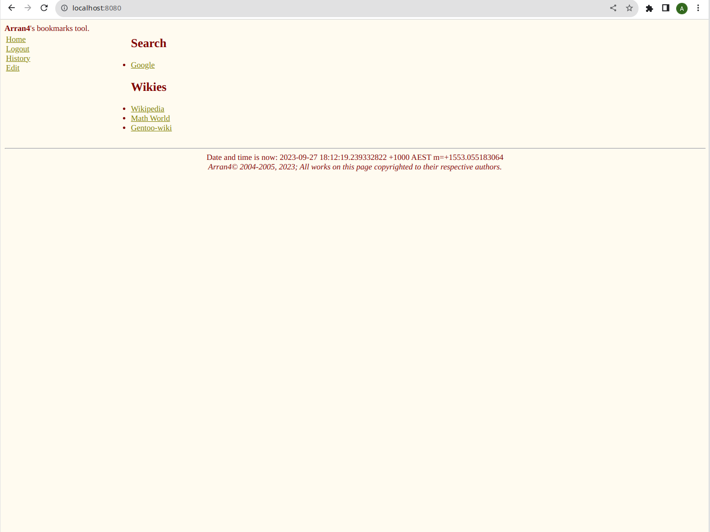
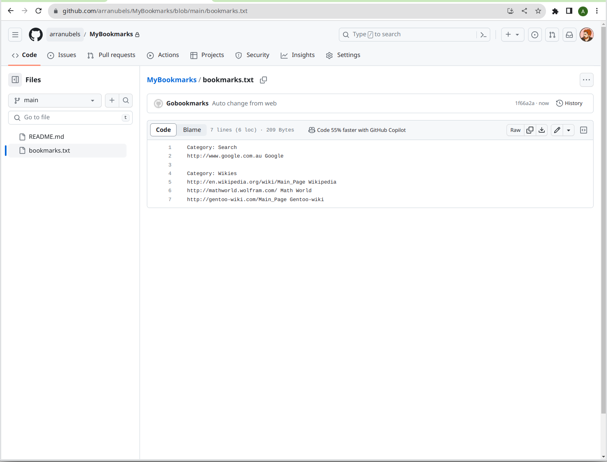
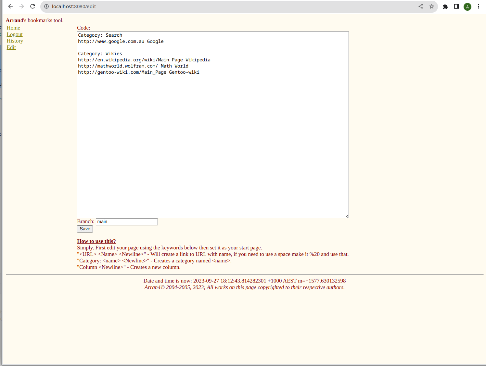
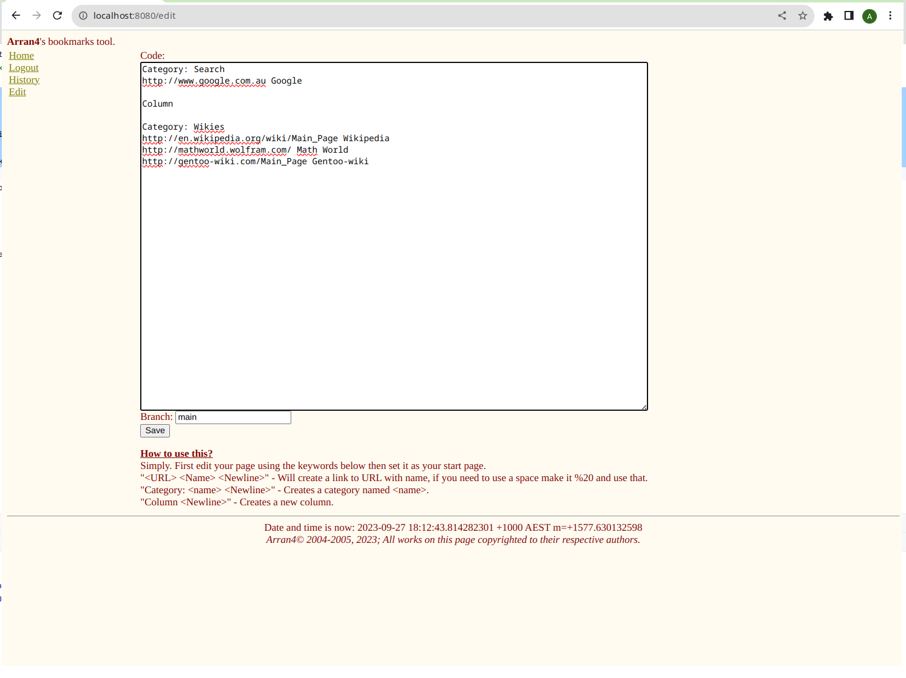
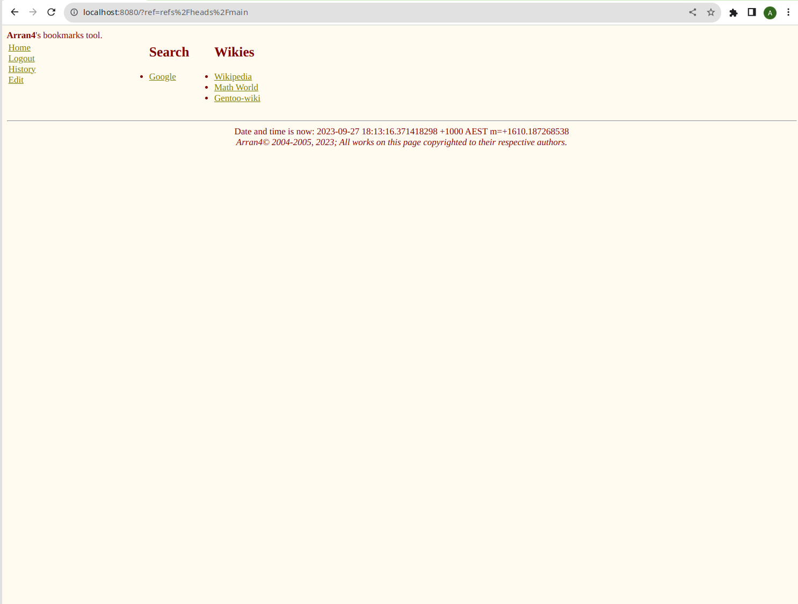

# gobookmarks


The purpose of the site is to display a list of links for you to see every time you open your browser. I have tried to 
move as much of the work into the app as possible with minimal effort but you will need to use github occasionally.



This project is a converstion of a project: [goa4web-bookmarks](https://github.com/arran4/goa4web-bookmarks) to remove
the SQL and replace it with Github. Which itself is extract from [goa4web](https://github.com/arran4/goa4web), which is
a Go port of a C++ site I made in 2003. Ported using ChatGPT: [a4web](https://github.com/arran4/a4web). It's all been
minimally modified and as close to the original as I could get but with the changes I required. I made modifications to
this because [StartHere](https://github.com/arran4/StartHere) my SPA version using modern tech failed because of Github
Oauth2 restrictions on SPA sites. You can read more about this here: https://arranubels.substack.com/p/quicklinks

# How to use

1. Create a (private or public doesn't matter) repo in github under your user name called: "MyBookmarks"
2. Create 1 file in it called `bookmarks.txt` Put the following content (or anything you want really):
```text
Category: Search
http://www.google.com.au Google
Category: Wikies
http://en.wikipedia.org/wiki/Main_Page Wikipedia
http://mathworld.wolfram.com/ Math World
http://gentoo-wiki.com/Main_Page Gentoo-wiki
```
Ie:

3. Goto the URL this app is deployed at, your private instance or: https://bookmarks.arran.net.au
4. Enjoy

## File format

It's a basic file format. Every command must be on it's own line empty lines are ignored.

| Code                   | Meaning                                                      |
|------------------------|--------------------------------------------------------------|
| `Category: <category>` | Will create a category title.                                |
| `<Link>`               | Will create a link to `<Link>` with the display name `<Link>` |
| `<Link> <Name>`        | Will create a link to `<Link>` with the display name `<Name>` |
| `Column`               | Will create a column                                         |
| `Page`                 | Creates a new page |
| `--`                   | Inserts a horizontal rule and resets columns |

## Editing

The `/edit` page allows updating the entire bookmark file.
Each category heading on the index page now includes a small pencil icon
link that opens `/editCategory`. This page shows only the selected
category text and saves changes back to your bookmarks without touching
other sections. Edits check the file's SHA so you'll get an error if it
changed while you were editing.







# How to setup for yourself

You can run this yourself. There is a docker version available under my github packages. There are also precompiled versions
under the releases section of this git repo: https://github.com/arran4/StartHere/releases

Configuration values can be supplied as environment variables, via a JSON configuration file or using command line arguments. Environment variables are the lowest priority, followed by the configuration file and finally command line arguments. If `/etc/gobookmarks/gobookmarks.env` exists it will be loaded before reading the environment.

| Name | Description |
| --- | --- |
| `OAUTH2_CLIENT_ID` | OAuth2 client ID from <https://github.com/settings/developers> |
| `OAUTH2_SECRET` | OAuth2 client secret from <https://github.com/settings/developers> |
| `EXTERNAL_URL` | Fully qualified URL the service is reachable on, e.g. `http://localhost:8080` |
| `GBM_CSS_COLUMNS` | If set (to any value) the `Column` keyword in your bookmarks will create CSS multi-column breaks rather than table cells. |
| `GBM_PROVIDER` | Git provider to use (`github` or `gitlab`). Defaults to `github`. |
| `GBM_NAMESPACE` | Optional suffix added to the bookmarks repository name. |
| `GBM_TITLE` | Overrides the page title shown in the browser. |
| `GIT_SERVER` | Base URL for a self-hosted git provider, e.g. `https://gitlab.example.com`. Defaults to the public server for the selected provider. |
| `GOBM_ENV_FILE` | Path to a file of `KEY=VALUE` pairs loaded before the environment. Defaults to `/etc/gobookmarks/gobookmarks.env`. |
| `GOBM_CONFIG_FILE` | Path to the JSON config file. If unset the program uses `$XDG_CONFIG_HOME/gobookmarks/config.json` or `$HOME/.config/gobookmarks/config.json` for normal users and `/etc/gobookmarks/config.json` when run as root. |

You can place these settings in `/etc/gobookmarks/gobookmarks.env` as `KEY=VALUE` pairs and the service will load them automatically if the file exists.
The release packages do not install this file; create it manually if you want to use environment-based settings.

Use `--config <path>` or set `GOBM_CONFIG_FILE` to control which configuration file is loaded.

The `--provider` command line flag or `GBM_PROVIDER` environment variable selects which git provider to use. By default the binary includes both GitHub and GitLab support. Use build tags `nogithub` or `nogitlab` to exclude either provider when building from source. If you specify an unknown provider the program will exit with an error listing the available options.
The `--title` flag or `GBM_TITLE` environment variable sets the browser page title.
Use `--git-server` or `GIT_SERVER` to override the base URL of the git provider (defaults to the provider's public server).

Running `gobookmarks --version` will print the version information along with the list of compiled-in providers.
Use `--dump-config` to print the final configuration after merging the environment,
config file and command line arguments.

## Oauth2 setup

Visit: https://github.com/settings/developers

Create an application, call it what ever you like. Set the Callback URL what ever you put in `EXTERNAL_URL` and add: 
`/oauth2Callback` to the end, ie if you entered: `http://localhost:8080` it should be: `http://localhost:8080/oauth2Callback`

Upload `logo.png` for the logo.

Generate a secret key and use it for the environment variables with the Client Id.

## Running as a Service

The release packages include service files for both `systemd` and FreeBSD
`rc.d`.  During installation these files can be copied to your system so the
server starts automatically on boot.

When installed from the release packages the service files pass
`--config /etc/gobookmarks/config.json`. An example config file is included in
the packages and is installed with permissions `0600` owned by the
`gobookmarks` user.  The installation process creates this user automatically
and both service files run the daemon as `gobookmarks`.

### Docker

The Docker image continues to work as before.  Mount `/data` if you need
persistent storage and pass the same environment variables as listed above.
You can also mount a config file and env file:

```bash
docker run -v /my/config.json:/etc/gobookmarks/config.json \
           -v /my/gobookmarks.env:/etc/gobookmarks/gobookmarks.env \
           -p 8080:8080 arran4/gobookmarks
```

