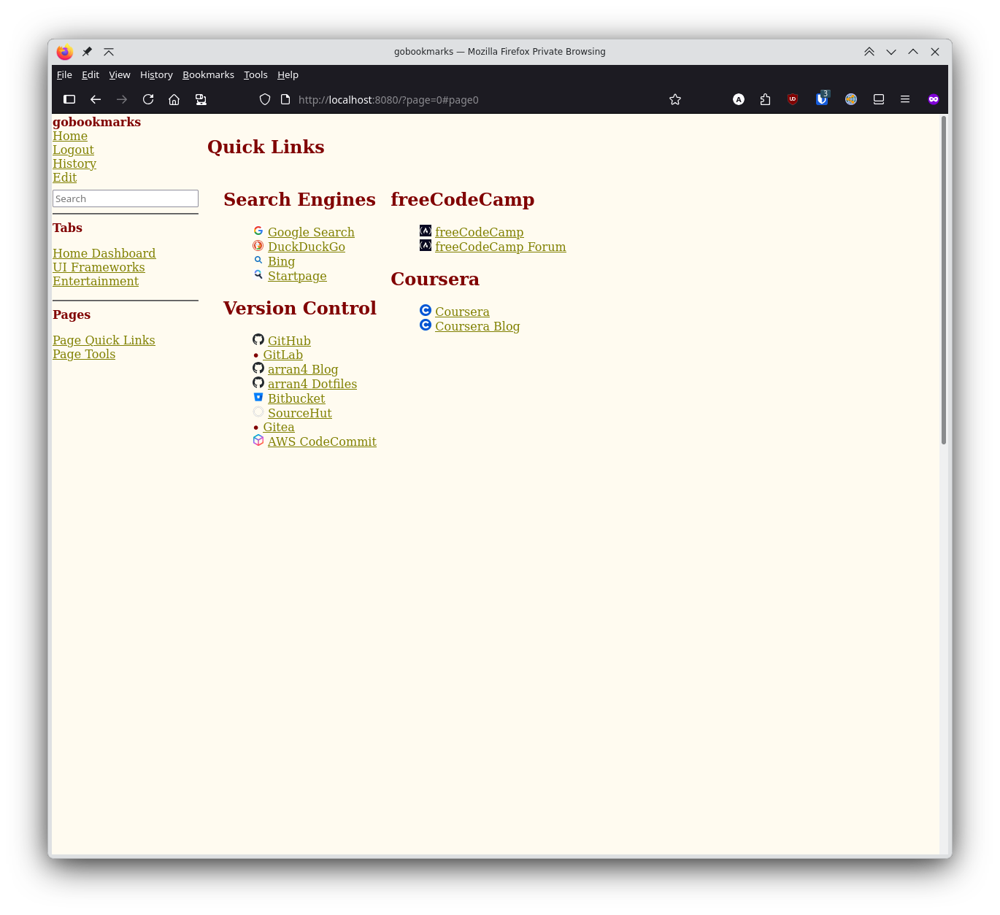
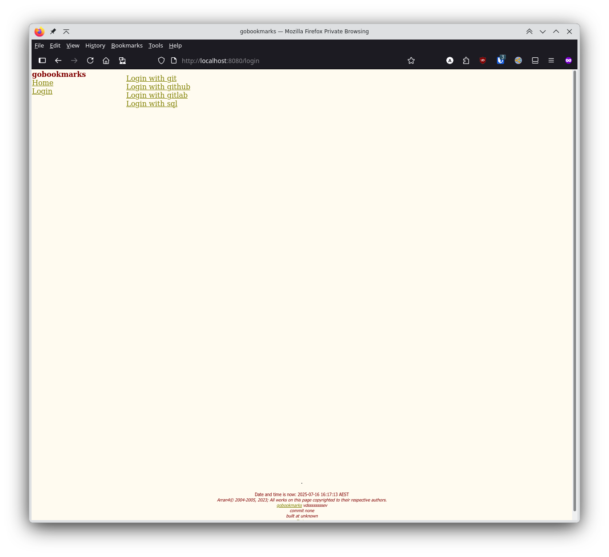
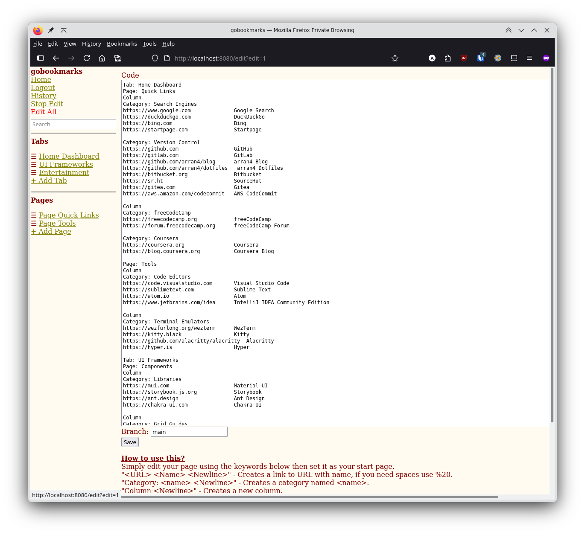
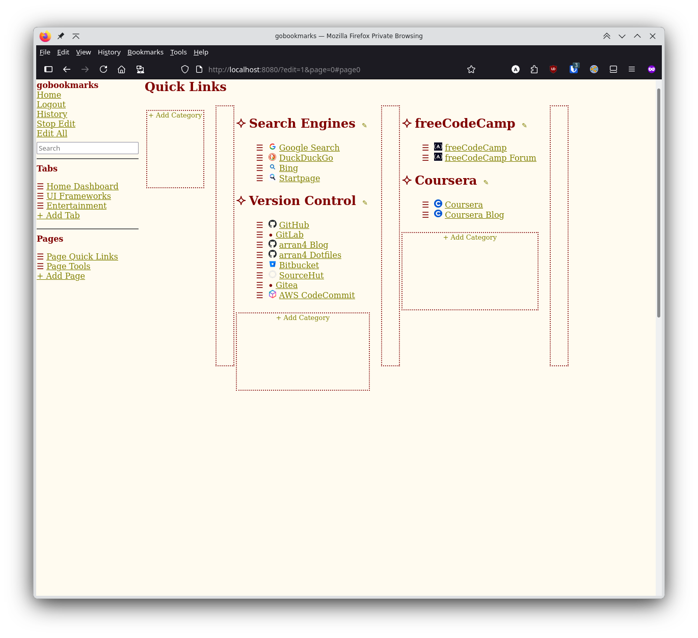
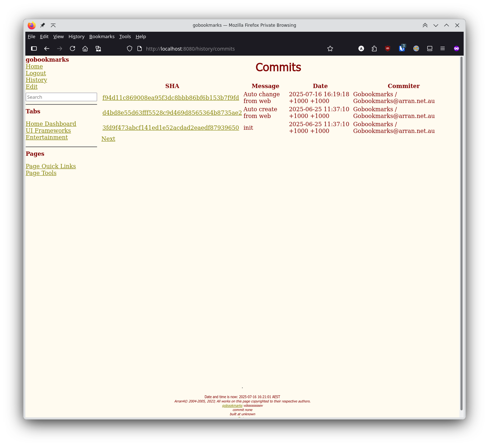
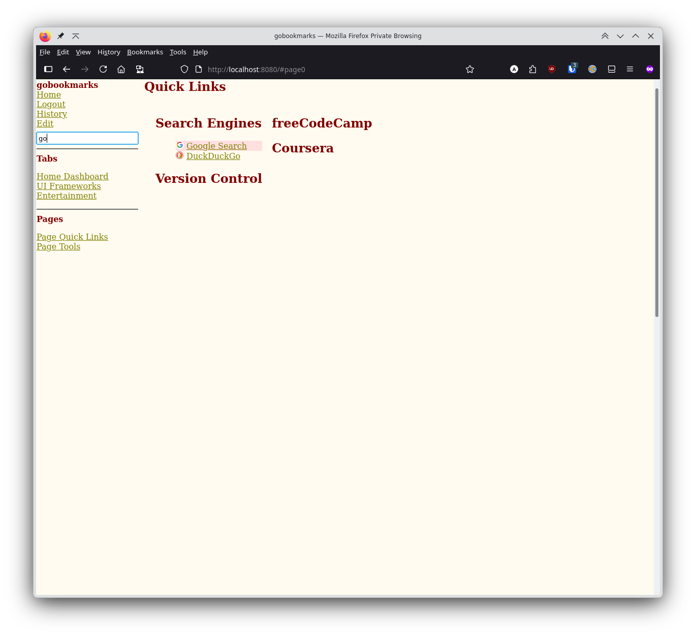

# gobookmarks


The purpose of the site is to display a list of links for you to see every time you open your browser. I have tried to
move as much of the work into the app as possible with minimal effort but you will need to use GitHub occasionally.



This project is a conversion of a project: [goa4web-bookmarks](https://github.com/arran4/goa4web-bookmarks) to remove
the SQL and replace it with GitHub. Which itself is extracted from [goa4web](https://github.com/arran4/goa4web), which is
a Go port of a C++ site I made in 2003. Ported using ChatGPT: [a4web](https://github.com/arran4/a4web). It's all been
minimally modified and as close to the original as I could get but with the changes I required. I made modifications to
this because [StartHere](https://github.com/arran4/StartHere) my SPA version using modern tech failed because of GitHub
OAuth2 restrictions on SPA sites. You can read more about this here: https://arranubels.substack.com/p/quicklinks

# How to use



1. Sign up or log in using a database, local Git, GitHub or GitLab. On first use the service
   creates a repository called `MyBookmarks` in your account containing a
   `bookmarks.txt` file like:

   ```text
   Category: Search
   http://www.google.com.au Google
   Category: Wikis
   http://en.wikipedia.org/wiki/Main_Page Wikipedia
   http://mathworld.wolfram.com/ Math World
   http://gentoo-wiki.com/Main_Page Gentoo-wiki
   ```
   
   
2. Go to the URL this app is deployed at.
3. Enjoy your new landing page / start page / bookmarks page.

## File format

It's a basic file format. Every command must be on its own line; empty lines are ignored.

| Code                   | Meaning |
|------------------------|-----------------------------------------------------|
| `Category[: <category>]` | Will create a category title. If unnamed it displays as `Category`. |
| `<Link>`               | Will create a link to `<Link>` with the display name `<Link>` |
| `<Link> <Name>`        | Will create a link to `<Link>` with the display name `<Name>` |
| `Column`               | Will create a column |
| `Page[: <name>]`       | Creates a new page and optionally names it |
| `Tab[: <name>]`        | Starts a new tab. Without a name it reverts to the main tab (switch using `?tab=<index>`) |
| `--`                   | Inserts a horizontal rule and resets columns |

Tabs contain one or more pages. The first tab is implicit and does not need a `Tab` directive unless you want to name it. Each `Page` line begins a new page within the current tab.

Example with two named columns:

```text
Category: Left
http://left.com
Column
Category: Right
http://right.com
```

### Big example

```text
Tab: Home Dashboard  
Page: Quick Links  
Column  
Category: Search Engines  
https://www.google.com              Google Search  
https://duckduckgo.com              DuckDuckGo  
https://bing.com                    Bing  
https://startpage.com               Startpage  

Category: Version Control  
https://github.com                  GitHub  
https://gitlab.com                  GitLab  
https://github.com/arran4/blog      arran4 Blog  
https://github.com/arran4/dotfiles   arran4 Dotfiles  
https://bitbucket.org               Bitbucket  
https://sr.ht                       SourceHut  
https://gitea.com                   Gitea  
https://aws.amazon.com/codecommit   AWS CodeCommit  

Column  
Category: freeCodeCamp  
https://freecodecamp.org            freeCodeCamp  
https://forum.freecodecamp.org      freeCodeCamp Forum  

Category: Coursera  
https://coursera.org                Coursera  
https://blog.coursera.org           Coursera Blog  

Page: Tools  
Column  
Category: Code Editors  
https://code.visualstudio.com       Visual Studio Code  
https://sublimetext.com             Sublime Text  
https://atom.io                     Atom  
https://www.jetbrains.com/idea      IntelliJ IDEA Community Edition  

Column  
Category: Terminal Emulators  
https://wezfurlong.org/wezterm      WezTerm  
https://kitty.black                 Kitty  
https://github.com/alacritty/alacritty  Alacritty  
https://hyper.is                    Hyper  

Tab: UI Frameworks  
Page: Components  
Column  
Category: Libraries  
https://mui.com                     Material‑UI  
https://storybook.js.org            Storybook  
https://ant.design                  Ant Design  
https://chakra-ui.com               Chakra UI  

Column  
Category: Grid Guides  
https://css-tricks.com/snippets/css/complete-guide-grid   CSS‑Tricks Grid Guide  
https://getbootstrap.com/docs/5.0/layout/grid/            Bootstrap Grid Guide  
https://tailwindcss.com/docs/grid-template-columns       Tailwind CSS Grid Guide  

Page: Reference  
Column  
Category: MDN Web Docs  
https://developer.mozilla.org      MDN Web Docs  
https://caniuse.com                Can I Use  
https://www.w3.org/standards       W3C Standards  
https://devdocs.io                 DevDocs  

Tab: Entertainment  
Page: Video  
Column  
Category: Videos  
https://youtube.com                YouTube  
https://netflix.com                Netflix  
https://primevideo.com             Prime Video  

Column  
Category: Tech News  
https://news.ycombinator.com       Hacker News  
https://arstechnica.com            Ars Technica  
https://techcrunch.com             TechCrunch  

Page: Podcasts  
Column  
Category: Podcasts  
https://talkpython.fm              Talk Python To Me  
https://developerhabits.com        Developer Habits  
https://syntax.fm                  Syntax.fm  

```

## Editing

### Visual editor

There is a visual editor which you can do some things such as rearrange links, categories,
pages, etc. It's designed to be for things which would be quicker to preform them that way
you can also just use the text version below.

Here is a visual demonstration of the edit capabilities:

There is a distinct edit mode. With some visual indication of what can be moved:



<video src="blob/main/media/simplescreenrecorder-2025-07-16_16.22.12.mp4" width="320" height="240" controls></video>

<video src="blob/main/media/simplescreenrecorder-2025-07-16_16.22.19.mp4" width="320" height="240" controls></video>

<video src="blob/main/media/simplescreenrecorder-2025-07-16_16.22.27.mp4" width="320" height="240" controls></video>

<video src="blob/main/media/simplescreenrecorder-2025-07-16_16.22.51.mp4" width="320" height="240" controls></video>

### Edit as text

The `/edit` page allows updating the entire bookmark file.
Each category heading on the index page now includes a small pencil icon
link that opens `/editCategory`. This page shows only the selected
category text and saves changes back to your bookmarks without touching
other sections. Edits check the file's SHA so you'll get an error if it
changed while you were editing.


## History 

All modes have a git (or git like) means of storing history, you can see your bookmarks
at any stage using this system:



## Search

You can quickly search for any link on the same Tab you're on. (Tabs contain pages.)



There is keyboard navigation, see keyboard shortcuts for details.


<video src="blob/main/media/simplescreenrecorder-2025-07-16_16.23.20.mp4" width="320" height="240" controls></video>

## Keyboard Shortcuts

The interface supports a number of keyboard shortcuts to make navigation
quicker:

* **Alt+K** focuses the search box and selects any existing text.
* **Alt+{** and **Alt+}** switch between bookmark tabs.
* **Alt+[** and **Alt+]** switch between pages within a tab.
* While the search box is focused, **Up/Down** or **Left/Right** arrows move
  between filtered results. Press **Enter** to open the selected link or
  **Ctrl+Enter**/**Meta+Enter** to open it in a background tab.
* Pressing **Esc** once exits the search field. Pressing **Esc** again clears
  the search and restores the previous view.
* Press **?** anywhere (outside of a text field) to see these shortcuts in a
  small help dialog.

# How to setup for yourself

You can run this yourself. Docker images are published to the [GitHub Container Registry](https://github.com/arran4/gobookmarks/pkgs/container/gobookmarks) as `ghcr.io/arran4/gobookmarks`.
There are also precompiled versions under the releases section of this git repo: https://github.com/arran4/gobookmarks/releases

Configuration values can be supplied as environment variables, via a JSON configuration file or using command line arguments. Environment variables are the lowest priority, followed by the configuration file and finally command line arguments. If `/etc/gobookmarks/gobookmarks.env` exists it will be loaded before reading the environment.

| Name | Description                                                                                                                                                                                                                                  |
| --- |----------------------------------------------------------------------------------------------------------------------------------------------------------------------------------------------------------------------------------------------|
| `GITHUB_CLIENT_ID` | GitHub OAuth2 client ID                                                                                                                                                                                                                      |
| `GITHUB_SECRET` | GitHub OAuth2 client secret                                                                                                                                                                                                                  |
| `GITLAB_CLIENT_ID` | GitLab OAuth2 client ID                                                                                                                                                                                                                      |
| `GITLAB_SECRET` | GitLab OAuth2 client secret                                                                                                                                                                                                                  |
| `EXTERNAL_URL` | Fully qualified URL the service is reachable on, e.g. `http://localhost:8080`                                                                                                                                                                |
| `GBM_CSS_COLUMNS` | If set (to any value) the `Column` keyword in your bookmarks is rendered using a flex-based layout that emulates table positioning.
| `GBM_NAMESPACE` | Optional suffix added to the bookmarks repository name.                                                                                                                                                                                      |
| `GBM_TITLE` | Overrides the page title shown in the browser.                                                                                                                                                                                               |
| `GBM_NO_FOOTER` | Hide footer on pages.                                                                                                                                                                                                                        |
| `FAVICON_CACHE_DIR` | Directory where fetched favicons are stored. If unset icons are kept only in memory. Defaults to `/var/cache/gobookmarks/favcache` when installed system‑wide (including the Docker image).                                                  |
| `FAVICON_CACHE_SIZE` | Maximum size in bytes of the favicon cache before old icons are removed. Defaults to `20971520`.                                                                                                                                             |
| `GITHUB_SERVER` | Base URL for GitHub (set for GitHub Enterprise).                                                                                                                                                                                             |
| `GITLAB_SERVER` | Base URL for GitLab (self-hosted).                                                                                                                                                                                                           |
| `LOCAL_GIT_PATH` | Directory used for the local git provider. Defaults to `/var/lib/gobookmarks/localgit` when installed system‑wide (including the Docker image).                                                                                              |
| `DB_CONNECTION_PROVIDER` | SQL driver name for the SQL provider. `mysql` or `sqlite`                                                                                                                                                                                    |
| `DB_CONNECTION_STRING` | Connection string for the SQL provider. File path for `sqlite` or `user:pass@/database?multiStatements=true` See https://github.com/go-sql-driver/mysql                                                                                      |
| `GBM_NO_FOOTER` | Hide the footer on pages.                                                                                                                                                                                                                    |
| `SESSION_KEY` | Secret used to sign session cookies. If unset the program reads or creates `session.key` under `$XDG_STATE_HOME/gobookmarks`, `$HOME/.local/state/gobookmarks` or `/var/lib/gobookmarks`.                                                    |
| `PROVIDER_ORDER` | Comma-separated list controlling the order login options are shown. Unrecognized names are ignored. Defaults to alphabetical order. |
| `GOBM_ENV_FILE` | Path to a file of `KEY=VALUE` pairs loaded before the environment. Defaults to `/etc/gobookmarks/gobookmarks.env`.                                                                                                                           |
| `GOBM_CONFIG_FILE` | Path to the JSON config file. If unset the program uses `$XDG_CONFIG_HOME/gobookmarks/config.json` or `$HOME/.config/gobookmarks/config.json` for normal users and `/etc/gobookmarks/config.json` when installed system‑wide or run as root. |

Favicons fetched for your bookmarks are cached on disk when `FAVICON_CACHE_DIR` is set. The `/proxy/favicon` endpoint also accepts a `size` parameter to scale icons on the fly.

You can place these settings in `/etc/gobookmarks/gobookmarks.env` as `KEY=VALUE` pairs and the service will load them automatically if the file exists.
The release packages do not install this file; create it manually if you want to use environment-based settings.

Use `--config <path>` or set `GOBM_CONFIG_FILE` to control which configuration file is loaded.

The `--title` flag or `GBM_TITLE` environment variable sets the browser page title.
The `--no-footer` flag or `GBM_NO_FOOTER` environment variable hides the footer on pages.
Use `--github-server` or `GITHUB_SERVER` to override the GitHub base URL and `--gitlab-server` or `GITLAB_SERVER` for GitLab.
Use `--no-footer` or `GBM_NO_FOOTER` to hide the footer on pages.
Use `--provider-order` or `PROVIDER_ORDER` to customize the login button order.

Running `gobookmarks --version` will print the version information along with the list of compiled-in providers.
When no OAuth2 credentials are configured the login buttons are hidden. Visit `/status` to see which providers are available.
Use `--dump-config` to print the final configuration after merging the environment,
config file and command line arguments.

## OAuth2 setup

For GitHub visit <https://github.com/settings/developers>. For GitLab visit <https://gitlab.com/-/profile/applications>.

Create an application, call it whatever you like. Set the Callback URL to whatever you put in `EXTERNAL_URL` and add:
`/oauth2Callback` to the end, ie if you entered: `http://localhost:8080` it should be: `http://localhost:8080/oauth2Callback`

Upload `logo.png` for the logo.

Generate a secret key and use it for the environment variables with the Client Id.

## Running as a Service

The release packages include service files for both `systemd` and FreeBSD
`rc.d`.  During installation these files can be copied to your system so the
server starts automatically on boot.

When installed from the release packages the service files pass
`--config /etc/gobookmarks/config.json`. An example config file is included in
the packages and is installed with permissions `0600` owned by the
`gobookmarks` user.  The installation process creates this user automatically
and both service files run the daemon as `gobookmarks`.

### Docker

The Docker image continues to work as before and now uses an Alpine base image. Mount `/var/cache/gobookmarks` if you need
persistent storage for favicons and `/var/lib/gobookmarks` for the git provider. These directories are also the defaults when gobookmarks is installed system-wide under `/usr`. Pass the same environment variables as listed above. The git provider stores data under
`$LOCAL_GIT_PATH/<sha256(username)>/` as a git repository with a `.password` file containing the bcrypt hash.
Create an account via `/signup/git`. This stores the password hash under
`$LOCAL_GIT_PATH/<sha256(username)>/.password` and creates the repository. Log in
later via `/login/git` using the same credentials. Passwords can be updated with
the provider's SetPassword method.

To locate the file, compute the SHA-256 of your username and look for the
corresponding directory. For example:

```bash
echo -n alice | sha256sum
```

The output hash forms the path `$LOCAL_GIT_PATH/<hash>/.password`.
Favicons are cached on disk under `/var/cache/gobookmarks/favcache` by default when the program is installed system‑wide or run in Docker. Set
`FAVICON_CACHE_DIR` to an empty string to disable disk caching.
The optional SQL provider stores bookmarks and passwords in a database when `DB_CONNECTION_PROVIDER` and `DB_CONNECTION_STRING` are set. Accounts are created through `/signup/sql` and log in via `/login/sql`. Only the latest bookmarks are returned; commit history is maintained in the `history` table.

### Legacy migration

The `sql/legacy_migrate.sql` file contains SQL statements that convert the
original `goa4web-bookmarks` tables into the schema used here. Execute the
script manually on your database before enabling the SQL provider.
You can run the container entirely via environment variables:

```bash
docker run -p 8080:8080 \
           -v /my/cache:/var/cache/gobookmarks \
           -v /my/db:/var/lib/gobookmarks \
           -e EXTERNAL_URL=http://localhost:8080 \
           -e GITHUB_CLIENT_ID=abc \
           -e GITHUB_SECRET=def \
           -e FAVICON_CACHE_DIR=/var/cache/gobookmarks/favcache \
           -e LOCAL_GIT_PATH=/var/lib/gobookmarks/localgit \
           -e DB_CONNECTION_PROVIDER=sqlite3 \
           -e DB_CONNECTION_STRING=/var/lib/gobookmarks/bookmarks.db \
           ghcr.io/arran4/gobookmarks
```

Alternatively you can mount a config file and environment file:

```bash
docker run -v /my/config.json:/etc/gobookmarks/config.json \
           -v /my/gobookmarks.env:/etc/gobookmarks/gobookmarks.env \
           -v /my/cache:/var/cache/gobookmarks \
           -v /my/db:/var/lib/gobookmarks \
           -p 8080:8080 ghcr.io/arran4/gobookmarks
```

An example `config.json` looks like:

```json
{
  "github_client_id": "",
  "github_secret": "",
  "gitlab_client_id": "",
  "gitlab_secret": "",
  "external_url": "http://localhost:8080",
  "css_columns": false,
  "namespace": "",
  "title": "",
  "no_footer": false,
  "github_server": "https://github.com",
  "gitlab_server": "https://gitlab.com",
  "favicon_cache_dir": "/var/cache/gobookmarks/favcache",
  "favicon_cache_size": 20971520,
  "local_git_path": "/var/lib/gobookmarks/localgit",
  "db_connection_provider": "sqlite3",
  "db_connection_string": "/var/lib/gobookmarks/bookmarks.db",
  "no_footer": false
}
```

#### Docker Compose

Using environment variables:

```yaml
version: '3'
services:
  gobookmarks:
    image: ghcr.io/arran4/gobookmarks
    ports:
      - "8080:8080"
    volumes:
      - cache:/var/cache/gobookmarks
      - db:/var/lib/gobookmarks
    environment:
      EXTERNAL_URL: "http://localhost:8080"
      GITHUB_CLIENT_ID: abc
      GITHUB_SECRET: def
      FAVICON_CACHE_DIR: /var/cache/gobookmarks/favcache
      LOCAL_GIT_PATH: /var/lib/gobookmarks/localgit
      DB_CONNECTION_PROVIDER: sqlite3
      DB_CONNECTION_STRING: /var/lib/gobookmarks/bookmarks.db
volumes:
  cache:
  db:
```

Using a config and env file:

```yaml
version: '3'
services:
  gobookmarks:
    image: ghcr.io/arran4/gobookmarks
    ports:
      - "8080:8080"
    volumes:
      - ./config.json:/etc/gobookmarks/config.json:ro
      - ./gobookmarks.env:/etc/gobookmarks/gobookmarks.env:ro
      - cache:/var/cache/gobookmarks
      - db:/var/lib/gobookmarks
volumes:
  cache:
  db:
```

