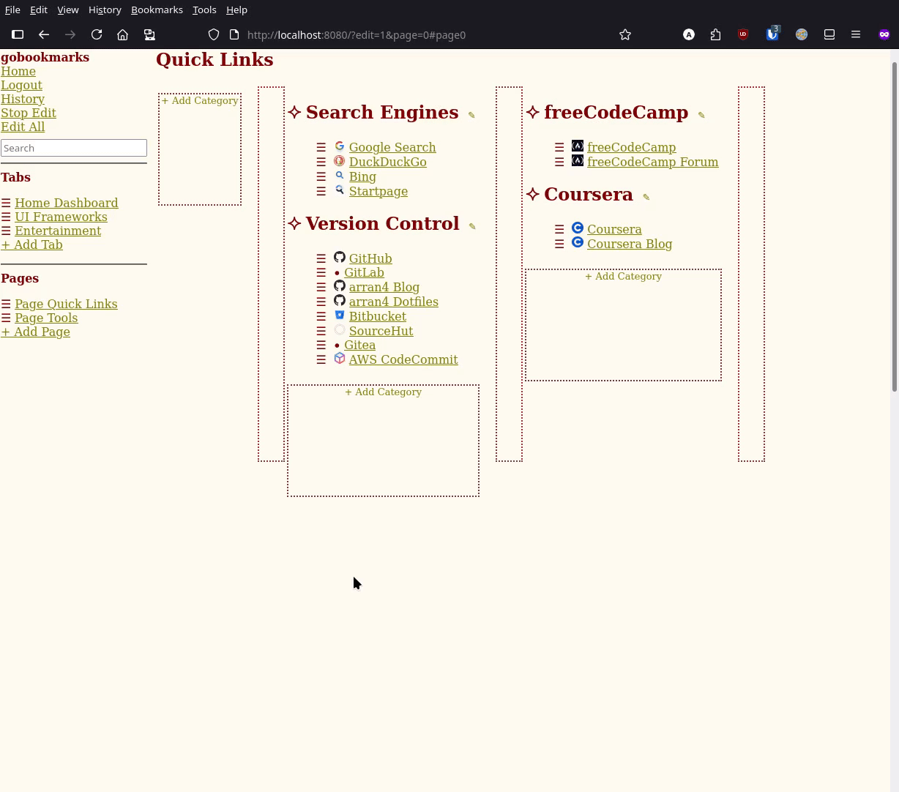
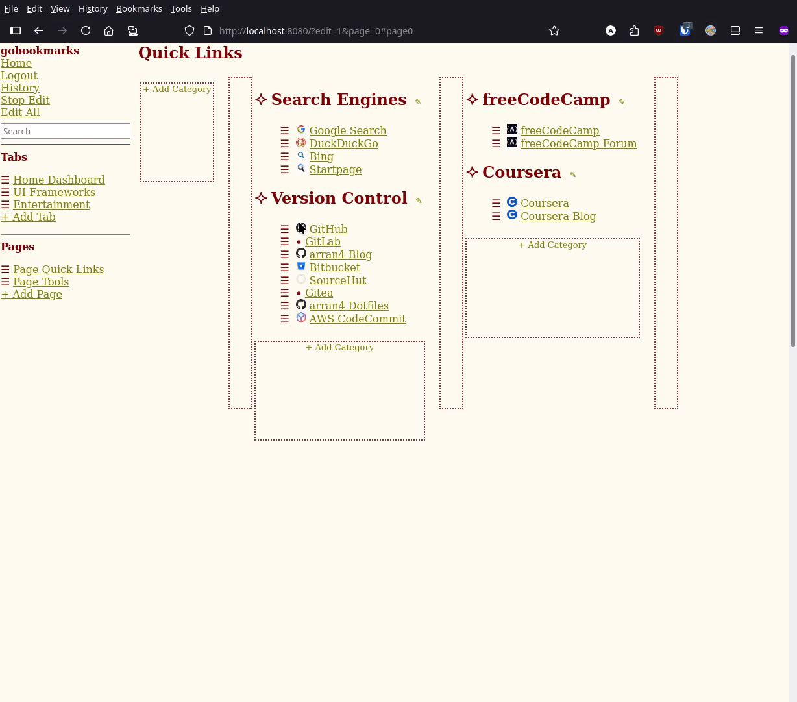
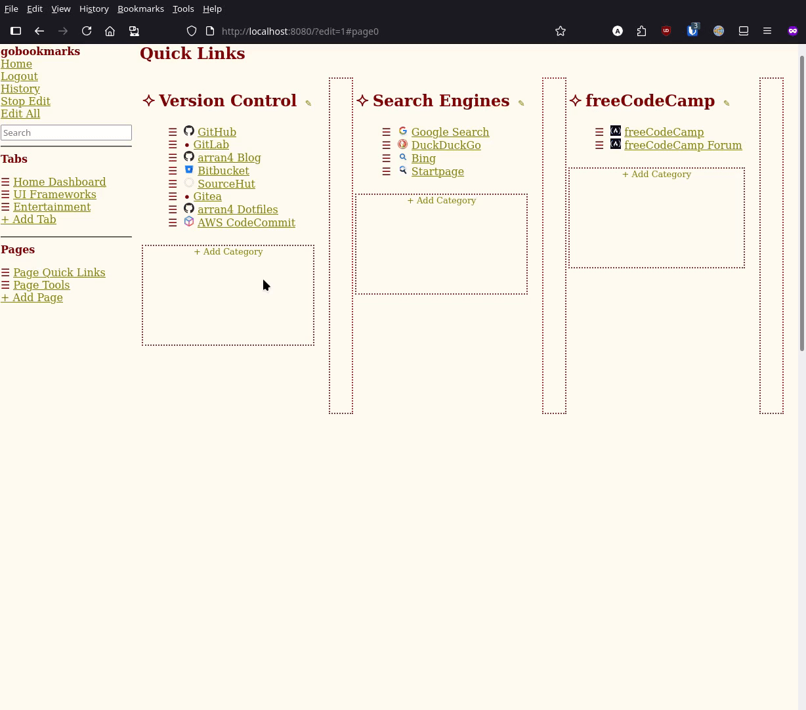

# gobookmarks


`gobookmarks` is a self-hosted personal landing page / start page that renders your bookmarks from a simple text file you own. Edit and store your data with visual tools or plain text, backed by Git (GitHub, GitLab, local Git, or SQL) so there is no lock-in and you always have history.


## Features

- Multi-page, multi-tab layout defined in a straightforward plaintext format.
- Visual editor for drag-and-drop reordering plus a full-text editor for quick bulk updates.
- Search with keyboard navigation and shortcut dialog (`?`).
- Git-backed history so you can roll back changes or browse previous versions.
- Multiple authentication providers: database, local Git, GitHub, and GitLab.

## Quick start

### Docker

Run the published image with environment variables for your OAuth credentials and external URL:

```bash
docker run -p 8080:8080 \
  -v /my/cache:/var/cache/gobookmarks \
  -v /my/db:/var/lib/gobookmarks \
  -e EXTERNAL_URL=http://localhost:8080 \
  -e GITHUB_CLIENT_ID=abc \
  -e GITHUB_SECRET=def \
  -e FAVICON_CACHE_DIR=/var/cache/gobookmarks/favcache \
  -e LOCAL_GIT_PATH=/var/lib/gobookmarks/localgit \
  ghcr.io/arran4/gobookmarks
```

### Docker Compose

Using environment variables:

```yaml
version: '3'
services:
  gobookmarks:
    image: ghcr.io/arran4/gobookmarks
    ports:
      - "8080:8080"
    volumes:
      - cache:/var/cache/gobookmarks
      - db:/var/lib/gobookmarks
    environment:
      EXTERNAL_URL: "http://localhost:8080"
      GITHUB_CLIENT_ID: abc
      GITHUB_SECRET: def
      FAVICON_CACHE_DIR: /var/cache/gobookmarks/favcache
      LOCAL_GIT_PATH: /var/lib/gobookmarks/localgit
volumes:
  cache:
  db:
```

Using a config and env file:

```yaml
version: '3'
services:
  gobookmarks:
    image: ghcr.io/arran4/gobookmarks
    ports:
      - "8080:8080"
    volumes:
      - ./config.json:/etc/gobookmarks/config.json:ro
      - ./gobookmarks.env:/etc/gobookmarks/gobookmarks.env:ro
      - cache:/var/cache/gobookmarks
      - db:/var/lib/gobookmarks
volumes:
  cache:
  db:
```

### From releases

Download a precompiled binary from [GitHub Releases](https://github.com/arran4/gobookmarks/releases) or use the Docker image `ghcr.io/arran4/gobookmarks`. Service files for `systemd` and FreeBSD `rc.d` are included in the release packages.

### Development build

```bash
go run ./cmd/gobookmarks
```

## How to use


1. Sign up or log in using a database, local Git, GitHub, or GitLab. On first use the service creates a repository called `MyBookmarks` in your account containing a `bookmarks.txt` file such as:

   ```text
   Category: Search
   http://www.google.com.au Google
   Category: Wikis
   http://en.wikipedia.org/wiki/Main_Page Wikipedia
   http://mathworld.wolfram.com/ Math World
   http://gentoo-wiki.com/Main_Page Gentoo-wiki
   ```

   

2. Visit the URL where the app is deployed.
3. Enjoy your new landing page / start page.

## Bookmark file format

Every command must be on its own line; empty lines are ignored.

| Code                     | Meaning                                                                                  |
|--------------------------|------------------------------------------------------------------------------------------|
| `Category[: <category>]` | Create a category title. If unnamed it displays as `Category`.                           |
| `<Link>`                 | Create a link to `<Link>` with the display name `<Link>`.                                 |
| `<Link> <Name>`          | Create a link to `<Link>` with the display name `<Name>`.                                 |
| `Column`                 | Start a new column.                                                                      |
| `Page[: <name>]`         | Create a new page and optionally name it.                                                |
| `Tab[: <name>]`          | Start a new tab. Without a name it reverts to the main tab (switch using `?tab=<index>`).|
| `--`                     | Insert a horizontal rule and reset columns.                                              |

Tabs contain one or more pages. The first tab is implicit and does not need a `Tab` directive unless you want to name it. Each `Page` line begins a new page within the current tab.

Example with two named columns:

```text
Category: Left
http://left.com
Column
Category: Right
http://right.com
```

### Bigger example

```text
Tab: Home Dashboard
Page: Quick Links
Column
Category: Search Engines
https://www.google.com              Google Search
https://duckduckgo.com              DuckDuckGo
https://bing.com                    Bing
https://startpage.com               Startpage

Category: Version Control
https://github.com                  GitHub
https://gitlab.com                  GitLab
https://github.com/arran4/blog      arran4 Blog
https://github.com/arran4/dotfiles   arran4 Dotfiles
https://bitbucket.org               Bitbucket
https://sr.ht                       SourceHut
https://gitea.com                   Gitea
https://aws.amazon.com/codecommit   AWS CodeCommit

Column
Category: freeCodeCamp
https://freecodecamp.org            freeCodeCamp
https://forum.freecodecamp.org      freeCodeCamp Forum

Category: Coursera
https://coursera.org                Coursera
https://blog.coursera.org           Coursera Blog

Page: Tools
Column
Category: Code Editors
https://code.visualstudio.com       Visual Studio Code
https://sublimetext.com             Sublime Text
https://atom.io                     Atom
https://www.jetbrains.com/idea      IntelliJ IDEA Community Edition

Column
Category: Terminal Emulators
https://wezfurlong.org/wezterm      WezTerm
https://kitty.black                 Kitty
https://github.com/alacritty/alacritty  Alacritty
https://hyper.is                    Hyper

Tab: UI Frameworks
Page: Components
Column
Category: Libraries
https://mui.com                     Material‑UI
https://storybook.js.org            Storybook
https://ant.design                  Ant Design
https://chakra-ui.com               Chakra UI

Column
Category: Grid Guides
https://css-tricks.com/snippets/css/complete-guide-grid   CSS‑Tricks Grid Guide
https://getbootstrap.com/docs/5.0/layout/grid/            Bootstrap Grid Guide
https://tailwindcss.com/docs/grid-template-columns       Tailwind CSS Grid Guide

Page: Reference
Column
Category: MDN Web Docs
https://developer.mozilla.org      MDN Web Docs
https://caniuse.com                Can I Use
https://www.w3.org/standards       W3C Standards
https://devdocs.io                 DevDocs

Tab: Entertainment
Page: Video
Column
Category: Videos
https://youtube.com                YouTube
https://netflix.com                Netflix
https://primevideo.com             Prime Video

Column
Category: Tech News
https://news.ycombinator.com       Hacker News
https://arstechnica.com            Ars Technica
https://techcrunch.com             TechCrunch

Page: Podcasts
Column
Category: Podcasts
https://talkpython.fm              Talk Python To Me
https://developerhabits.com        Developer Habits
https://syntax.fm                  Syntax.fm
```

## Editing

### Visual editor

There is a visual editor that lets you rearrange links, categories, pages, and tabs. Use it for quick drag-and-drop adjustments; you can always fall back to the text editor for larger changes.



 

 

 


### Edit as text

The `/edit` page allows updating the entire bookmark file. Each category heading includes a pencil icon that opens `/editCategory`, which shows only that category and saves changes back to your bookmarks. Edits check the file's SHA so you'll get an error if it changed while you were editing.


## History

All providers maintain git-like history so you can browse or roll back to any previous state.


## Search

You can quickly search for any link on the same tab you're on (tabs contain pages). Keyboard navigation is supported—use the arrow keys to move through results. Press **Enter** to open the selected link, **Shift+Enter** for a background tab, and hold **Alt** to keep the entered text.

[](media/simplescreenrecorder-2025-07-16_16.23.20.gif)

### Search widgets

Use a link starting with the `search:` scheme followed by a URL containing `$query`, for example:

```
search:https://www.google.com/search?q=$query
```


## Keyboard shortcuts

- **Alt+K** or **Ctrl+K**/**Cmd+K** focuses the search box and selects any existing text.
- **Alt+{** and **Alt+}** switch between bookmark tabs.
- **Alt+[** and **Alt+]** switch between pages within a tab.
- While the search box is focused, **Up/Down** or **Left/Right** arrows move between filtered results. Press **Enter** to open the selected link or **Ctrl+Enter**/**Meta+Enter** to open it in a background tab.
- Pressing **Esc** inside the search field removes focus. Pressing **Esc** again clears the search and restores the previous view. Search widgets use the same pattern, with a third **Esc** press clearing all widget text.
- Press **?** anywhere (outside of a text field) to see these shortcuts in a small help dialog.

## Configuration

Configuration values can be supplied as environment variables, via a JSON configuration file, or using command line arguments. Environment variables are the lowest priority, followed by the configuration file, then command line arguments. If `/etc/gobookmarks/gobookmarks.env` exists it will be loaded before reading the environment.

| Name | Description |
| --- | --- |
| `EXTERNAL_URL` | Fully qualified URL the service is reachable on, e.g. `http://localhost:8080`. |
| `GITHUB_CLIENT_ID` / `GITHUB_SECRET` | GitHub OAuth2 client ID and secret. |
| `GITLAB_CLIENT_ID` / `GITLAB_SECRET` | GitLab OAuth2 client ID and secret. |
| `GITHUB_SERVER` | Base URL for GitHub (set for GitHub Enterprise). |
| `GITLAB_SERVER` | Base URL for GitLab (self-hosted). |
| `LOCAL_GIT_PATH` | Directory used for the local git provider. Defaults to `/var/lib/gobookmarks/localgit` when installed system-wide (including the Docker image). |
| `DB_CONNECTION_PROVIDER` | SQL driver name for the SQL provider (`mysql` or `sqlite3`). |
| `DB_CONNECTION_STRING` | Connection string for the SQL provider. File path for `sqlite3` or `user:pass@/database?multiStatements=true` for MySQL. |
| `SESSION_KEY` | Secret used to sign session cookies. If unset the program reads or creates `session.key` under `$XDG_STATE_HOME/gobookmarks`, `$HOME/.local/state/gobookmarks`, or `/var/lib/gobookmarks`. |
| `PROVIDER_ORDER` | Comma-separated list controlling the order login options are shown. Unrecognized names are ignored; defaults to alphabetical order. |
| `GBM_CSS_COLUMNS` | If set (to any value) the `Column` keyword is rendered using a flex-based layout that emulates table positioning. |
| `GBM_NAMESPACE` | Optional suffix added to the bookmarks repository name. |
| `GBM_TITLE` | Overrides the page title shown in the browser. |
| `GBM_NO_FOOTER` | Hide footer on pages. |
| `GBM_DEV_MODE` | Enable developer helpers like `/_css` and `/_table`. Defaults to on when built as `dev`. |
| `FAVICON_CACHE_DIR` | Directory where fetched favicons are stored. If unset icons are kept only in memory. Defaults to `/var/cache/gobookmarks/favcache` when installed system-wide (including the Docker image). |
| `FAVICON_CACHE_SIZE` | Maximum size in bytes of the favicon cache before old icons are removed. Defaults to `20971520`. |
| `GOBM_ENV_FILE` | Path to a file of `KEY=VALUE` pairs loaded before the environment. Defaults to `/etc/gobookmarks/gobookmarks.env`. |
| `GOBM_CONFIG_FILE` | Path to the JSON config file. If unset the program uses `$XDG_CONFIG_HOME/gobookmarks/config.json` or `$HOME/.config/gobookmarks/config.json` for normal users and `/etc/gobookmarks/config.json` when installed system-wide or run as root. |

Use `--config <path>` or set `GOBM_CONFIG_FILE` to control which configuration file is loaded.

### Command-line reference

- `--config <path>` or `GOBM_CONFIG_FILE` chooses the configuration file to load.
- `--title <text>` or `GBM_TITLE` sets the browser page title.
- `--no-footer` or `GBM_NO_FOOTER` hides the footer on pages.
- `--dev-mode` or `GBM_DEV_MODE` toggles developer helpers like `/_css` and `/_table`.
- `--github-server <url>` or `GITHUB_SERVER` overrides the GitHub base URL; `--gitlab-server <url>` or `GITLAB_SERVER` does the same for GitLab.
- `--provider-order <list>` or `PROVIDER_ORDER` customizes the login button order.
- `--dump-config` prints the final configuration after merging environment variables, the config file, and command line arguments.
- `--version` prints version information and the list of compiled-in providers.

When no OAuth2 credentials are configured the login buttons are hidden. Visit `/status` to see which providers are available.

## OAuth2 setup

For GitHub visit <https://github.com/settings/developers>. For GitLab visit <https://gitlab.com/-/profile/applications>.

Create an application and set the callback URL to `<EXTERNAL_URL>/oauth2Callback` (for example `http://localhost:8080/oauth2Callback`). Upload `logo.png` for the logo and use the generated client ID and secret for the environment variables.

## Running as a service

The release packages include service files for both `systemd` and FreeBSD `rc.d`. During installation these files can be copied to your system so the server starts automatically on boot. The service files pass `--config /etc/gobookmarks/config.json` and install an example config file with permissions `0600` owned by the `gobookmarks` user (created during installation).

## Docker details

The Docker image uses an Alpine base image. Mount `/var/cache/gobookmarks` if you need persistent storage for favicons and `/var/lib/gobookmarks` for the git provider. The git provider stores data under `$LOCAL_GIT_PATH/<sha256(username)>/` as a git repository with a `.password` file containing the bcrypt hash. Create an account via `/signup/git` and log in via `/login/git`. Passwords can be updated with the provider's SetPassword method.

To locate the password file, compute the SHA-256 of your username and look for the corresponding directory, for example:

```bash
echo -n alice | sha256sum
```

The optional SQL provider stores bookmarks and passwords in a database when `DB_CONNECTION_PROVIDER` and `DB_CONNECTION_STRING` are set. Accounts are created through `/signup/sql` and log in via `/login/sql`. Only the latest bookmarks are returned; commit history is maintained in the `history` table.

You can also mount a config file and environment file:

```bash
docker run -v /my/config.json:/etc/gobookmarks/config.json \
           -v /my/gobookmarks.env:/etc/gobookmarks/gobookmarks.env \
           -v /my/cache:/var/cache/gobookmarks \
           -v /my/db:/var/lib/gobookmarks \
           -p 8080:8080 ghcr.io/arran4/gobookmarks
```

An example `config.json` looks like:

```json
{
  "github_client_id": "",
  "github_secret": "",
  "gitlab_client_id": "",
  "gitlab_secret": "",
  "external_url": "http://localhost:8080",
  "css_columns": false,
  "namespace": "",
  "title": "",
  "no_footer": false,
  "github_server": "https://github.com",
  "gitlab_server": "https://gitlab.com",
  "favicon_cache_dir": "/var/cache/gobookmarks/favcache",
  "favicon_cache_size": 20971520,
  "local_git_path": "/var/lib/gobookmarks/localgit",
  "db_connection_provider": "sqlite3",
  "db_connection_string": "/var/lib/gobookmarks/bookmarks.db",
  "no_footer": false
}
```

## Legacy migration

The `sql/legacy_migrate.sql` file contains SQL statements that convert the original `goa4web-bookmarks` tables into the schema used here. Execute the script manually on your database before enabling the SQL provider.
